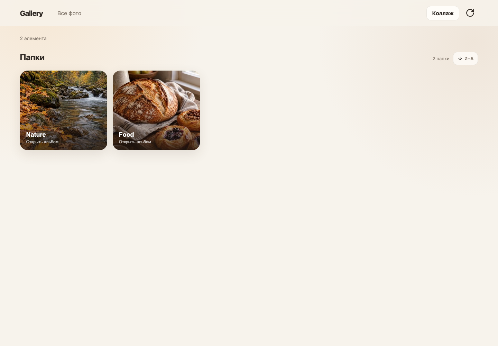
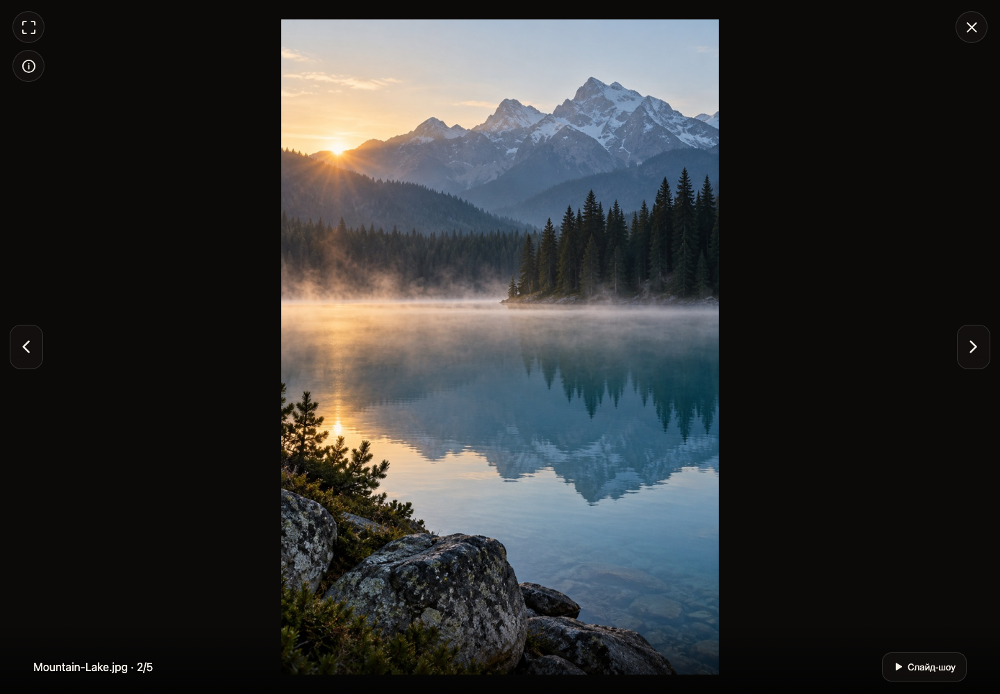
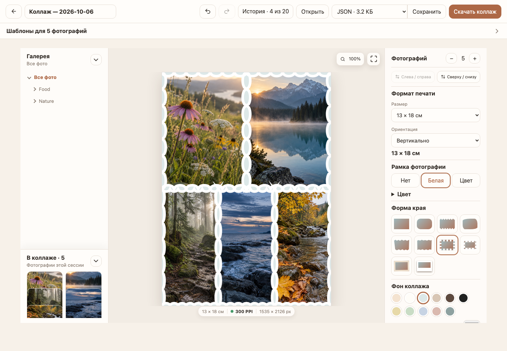
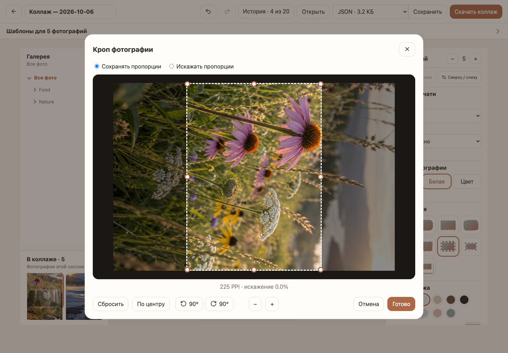
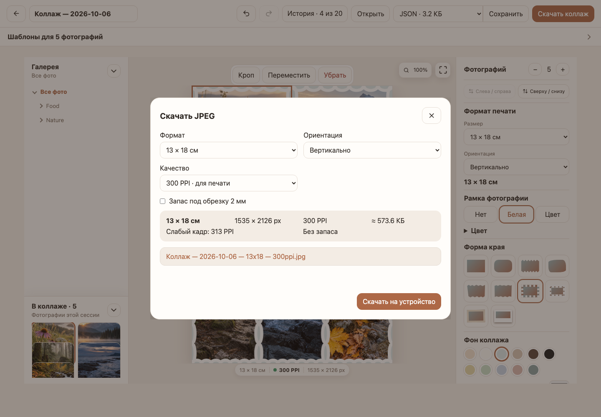

<div align="center">
  <h1>LiteGallery</h1>
  <p><strong>A lightweight, warm-looking photo and video gallery for an existing filesystem library.</strong></p>
  <p>
    
    
    
    
  </p>
</div>

LiteGallery turns a directory tree into a responsive, read-only gallery. It is
distributed as one statically linked Go binary with an embedded web UI: no
database, Node.js build, CGO, FFmpeg, or background cloud service is required.

It is designed for small home servers and NAS appliances where the original
photo library already has a useful folder structure and must remain untouched.



## Highlights

- Folder cards with covers taken from the first available image.
- Responsive masonry layout for phones, desktop browsers, and TVs.
- Photo and video viewer with fit-to-screen and fullscreen modes.
- Keyboard, remote-control focus, swipe, and previous/next navigation.
- Filters for all media, photos only, or videos only.
- Sorting by filename or capture date, in either direction.
- On-demand EXIF details: capture time, camera, lens, exposure, dimensions,
  and GPS when present.
- Pure-Go capture-time parsing for MP4-family video containers.
- Disk-backed thumbnail and browser-generated video-poster cache.
- Incremental cache warmer with locking, progress logs, and stale-entry pruning.
- Browser-based collage editor with print-ready JPEG export and local project
  files.
- Count-aware collage templates, crop-quality checks, full-canvas focus mode,
  and non-destructive zoom/pan previews for both the collage and source photos.
- RAW files and unrelated sidecars, databases, archives, and documents stay
  out of the gallery.

## Feature matrix

| Capability | Support |
| --- | --- |
| Photos | JPEG, PNG, GIF, BMP, and TIFF |
| Videos | MP4, MOV, M4V, AVI, MTS, M2TS, and 3GP |
| RAW files | Hidden from the gallery |
| EXIF | Capture time, camera, lens, exposure, ISO, dimensions, and GPS |
| Sorting | Filename or capture date, in either direction |
| Filters | All media, photos only, or videos only |
| Previews | Disk-backed cache with scheduled warming |
| Collages | 2–12 photos, reusable templates, crop tools, named local JSON/ZIP projects, and print-ready JPEG export |
| Interface | Responsive layouts for phones, computers, and TVs |
| Runtime | One static binary, without a database or FFmpeg |
| Platforms | FreeBSD amd64 and Linux amd64/arm64 |

## Quick start

```sh
go run . \
  -root /srv/photos \
  -cache /srv/litegallery-cache \
  -listen 127.0.0.1:8090
```

Open <http://127.0.0.1:8090>.

For access from other devices on the local network, bind to an appropriate
interface, for example `-listen 0.0.0.0:8090`, and use your NAS hostname in the
browser: `http://nas.local:8090`.

## How it works

```text
Browser ── list/media/EXIF requests ──> LiteGallery ── read-only ──> Photo library
   │                                      │
   └── video poster upload ───────────────┴── read/write ───────> Cache directory

Scheduled task ── warm thumbnails + metadata + prune stale cache ────────────┘
```

The web service reads the original library but never renames, uploads, edits,
or deletes original media. Thumbnail files, video posters, metadata manifests,
and scan markers live only in the configured cache directory.

## Media support

| Kind | Extensions | Behaviour |
| --- | --- | --- |
| Images | JPEG, PNG, GIF, BMP, TIFF | Thumbnails are generated by LiteGallery. |
| Video | MP4, MOV, M4V, AVI, MTS, M2TS, 3GP | Playback depends on browser codec support. |
| RAW and other files | ARW and all unlisted extensions | Not displayed. |

Video posters are generated by the first capable browser that opens a video
tile, uploaded as a small JPEG, and reused by other devices. This keeps the NAS
free of multimedia package dependencies.

## Capture dates and metadata

Photo EXIF is read with
[`github.com/evanoberholster/imagemeta`](https://github.com/evanoberholster/imagemeta).
MP4-family container creation time is parsed in pure Go with
[`github.com/abema/go-mp4`](https://github.com/abema/go-mp4).

Date sorting uses this order:

1. EXIF capture time for supported photos.
2. Container creation time for supported MP4-family videos.
3. Filesystem creation time as a fallback.

Photos and videos open in a dark full-screen viewer. Its controls fade out
after a short pause and return on any mouse, touch, or keyboard input; arrow
keys and swipes move between items, and Space starts a slideshow.



The viewer loads detailed EXIF only when its info button is opened. The cache
warmer maintains compact per-directory metadata manifests so normal folder
browsing does not rescan every original file.

## Collage editor

Open a folder, press **Collage**, and select between 2 and 12 photos. The editor
can combine photos from several gallery folders and allows the same photo to
fill more than one cell. A saved JSON or ZIP project can also be opened
directly from the collage-selection bar.



The editor includes:

- layouts matched to the selected photo count, with horizontal and vertical
  reflection controls instead of mirrored duplicates in the chooser;
- automatic filling plus manual replacement, movement, and removal;
- a folder tree that shows one gallery folder at a time and an **In collage**
  tray with every photo used during the session. Clicking a tray photo that is
  already placed selects its cell; a following click on an empty cell adds the
  photo again, which is handy for photos from folders that are no longer open;
- frame styles, decorative edge shapes, spacing, and colour palettes derived
  from the background;
- a 20-step undo/redo history;
- a focus mode that gives the canvas the whole workspace, and zoom/pan
  inspection for the collage and large photo previews that never changes the
  exported result;
- local projects saved as compact JSON or as a self-contained ZIP with photos;
  opening another project asks before discarding unsaved changes;
- print preflight with warnings that can be reviewed or explicitly ignored.

Project compatibility is determined by the document `formatVersion`. The
saved `appVersion` records which LiteGallery release created the project for
diagnostics, but does not reject an otherwise compatible project.

### Crop and rotate

The crop editor moves and resizes the crop frame rather than the photo. It
offers fixed-ratio and free-ratio modes, 90° left/right rotation, and live PPI
feedback. Crop and rotation are kept in saved projects and in the exported
JPEG.



### Print-ready JPEG export

JPEG export supports 10 × 15, 13 × 18, 15 × 20, 20 × 30, and 30 × 45 cm, plus
exact A4 (210 × 297 mm), at 300 PPI with an optional 2 mm bleed. The summary
shows pixel dimensions, the weakest photo's PPI, and the estimated file size.



### How collages are processed

Editing, rendering, and export happen in the browser. Project files and JPEGs
are downloaded to the user's device, and original files in the gallery remain
read-only. Selected originals are decoded one at a time before the first
layout is shown, so the editor displays a loading state instead of a partially
rendered collage without holding every original in memory at once. See
[`docs/collage-editor-design.md`](docs/collage-editor-design.md) for the
detailed product and technical decisions.

### Limitations

- The editor targets desktop and tablet browsers.
- When a selected photo is larger than 40 megapixels, the selection bar warns
  that the browser may close because of limited memory, especially on a phone
  or tablet. The export dialog warns when a format exceeds the canvas size that
  mobile browsers can render (for example 30 × 45 cm at 300 PPI). Neither
  warning blocks the collage.
- TIFF files remain available in the gallery but cannot be used in collages.

## Cache warming

Run the same binary as a one-shot scheduled task:

```sh
/usr/local/sbin/litegallery \
  -root /srv/photos \
  -cache /srv/litegallery-cache \
  -warm-cache \
  -prune-cache \
  -prune-after 168h \
  -min-interval 24h \
  -workers 1
```

An hourly scheduler works well for a NAS that is not always powered on.
`-min-interval 24h` makes recent successful scans exit quickly. A lock prevents
overlapping warmers. Pruning runs only after a complete, non-empty scan and
removes stale LiteGallery cache entries only after the configured grace period.

## XigmaNAS and FreeBSD

Build a static FreeBSD amd64 binary on any machine with Go installed:

```sh
make build-freebsd
```

The output is `build/litegallery-freebsd-amd64`.

Builds from a Git checkout embed the value of `git describe` automatically.
Pass `VERSION=<tag>` only when building from a source tree without matching Git
metadata or when an explicit version override is required.

For Linux-based NAS distributions, build all common architectures:

```sh
make build-linux
```

This produces `litegallery-linux-amd64` and `litegallery-linux-arm64` in
`build/`. Individual targets with the same suffixes are also available. The
64-bit binaries are statically linked and are not tied to a specific Linux
distribution.

Copy it to the NAS, for example as `/usr/local/sbin/litegallery`, then copy
[`deploy/litegallery.rc`](deploy/litegallery.rc) to a persistent location. The
script supports `start`, `stop`, `restart`, and `status` and runs LiteGallery as
the unprivileged `www` user.

Its defaults are intentionally generic. Override them in the XigmaNAS startup
environment or edit your private copy:

```sh
litegallery_root="/mnt/tank/photos"
litegallery_cache="/mnt/tank/litegallery-cache"
litegallery_listen="0.0.0.0:8090"
litegallery_program="/usr/local/sbin/litegallery"
```

The data directory must be readable by the service account; the cache directory
must be writable by it. Keep the service on a trusted LAN or place an
authenticated reverse proxy in front of it: LiteGallery does not provide user
accounts or TLS.

## Command-line options

| Flag | Default | Description |
| --- | --- | --- |
| `-root` | required | Photo library root. |
| `-cache` | `./cache` | Thumbnail and metadata cache directory. |
| `-listen` | `127.0.0.1:8090` | HTTP listen address. |
| `-title` | `Gallery` | Page title. |
| `-thumb-size` | `480` | Maximum thumbnail side in pixels, from 128 to 1600. |
| `-max-image-pixels` | `100000000` | Reject larger source images before full decoding. |
| `-warm-cache` | off | Warm missing thumbnails and metadata, then exit. |
| `-workers` | `1` | Cache-warmer workers, from 1 to 16. |
| `-min-interval` | `24h` | Skip a warm scan after a recent successful run. |
| `-prune-cache` | off | Prune stale cache entries after a successful scan. |
| `-prune-after` | `168h` | Minimum stale-entry age before pruning. |

## Security model and limitations

- Requested paths and resolved symlinks are constrained to the configured
  library root.
- Original media is never modified through LiteGallery.
- The browser may write only validated JPEG video posters into the cache.
- Thumbnail generation checks source dimensions before full image decoding to
  limit memory use from malformed or unexpectedly large images.
- There is no upload, rename, delete, authentication, authorization, or TLS
  endpoint.
- Video playback depends on the codecs supported by the client browser.
- Corrupt or unsupported images are logged and skipped during cache warming.

## Development

Node.js is used only for JavaScript tests, Playwright browser tests, and type
checking. LiteGallery does not have a frontend build step and the shipped web
assets remain embedded directly in the Go binary.

```sh
npm ci
npm run typecheck
npm run test:js
npm run test:e2e:essential
go test ./...
go vet ./...
make build-freebsd
make build-linux
```

### Browser tests

Playwright starts its own LiteGallery server on `127.0.0.1:18090` with
generated demo fixtures, so only one run can be active at a time. After `npm ci`,
install the browsers once with `npx playwright install chromium webkit firefox`.

There are two suites:

| Suite | Command | When | Scope |
| --- | --- | --- | --- |
| Essential | `npm run test:e2e:essential` | before every commit | tests tagged `@essential`, Chromium desktop only, stops at the first failure (about 15 seconds) |
| Full | `npm run test:e2e:full` | before a release | every spec in every configured browser and viewport, stops after 3 failures |

Useful variants:

```sh
# One spec while fixing it
npx playwright test tests/e2e/project-export.spec.mjs --project=chromium-desktop --max-failures=1

# Re-run only the tests that failed last time
npx playwright test --last-failed --max-failures=3
```

A failing assertion waits up to the 45-second test timeout, so keep
`--max-failures` on local runs instead of waiting for every broken test. Run the
changed spec immediately after editing it. Tag a test as essential with
`test('…', {tag: '@essential'}, async …)` only when it covers a core user flow;
keep the essential suite short. Failure screenshots and traces are written to
the temporary runtime directory printed in the report.

### Releases

Release assets are built from a clean checkout of a release tag:

```sh
git switch main && git pull --ff-only
git tag -a v0.2.2 -m "LiteGallery v0.2.2"
git push origin v0.2.2
make release
gh release create v0.2.2 dist/* --title "LiteGallery v0.2.2" --notes-file <notes.md>
```

`make release` refuses to build when `git describe` is not an exact `vX.Y.Z`
tag or the tree has uncommitted changes. It writes the FreeBSD and Linux
binaries plus a `SHA256SUMS` file with bare file names to `dist/`, so
downloads can be verified with `shasum -a 256 -c SHA256SUMS`.

### Documentation screenshots

The screenshots in `docs/screenshots/` are generated from demo fixtures. After a
visible UI change, refresh them with:

```sh
npm run screenshots:docs
```

Never use photos from a real library for documentation.

User-visible changes belong in [`CHANGELOG.md`](CHANGELOG.md). Repository rules
for coding agents are documented in [`AGENTS.md`](AGENTS.md).

## License

LiteGallery is available under the [MIT License](LICENSE).
